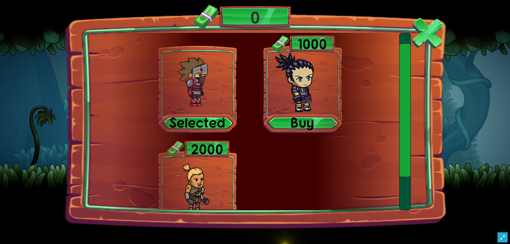
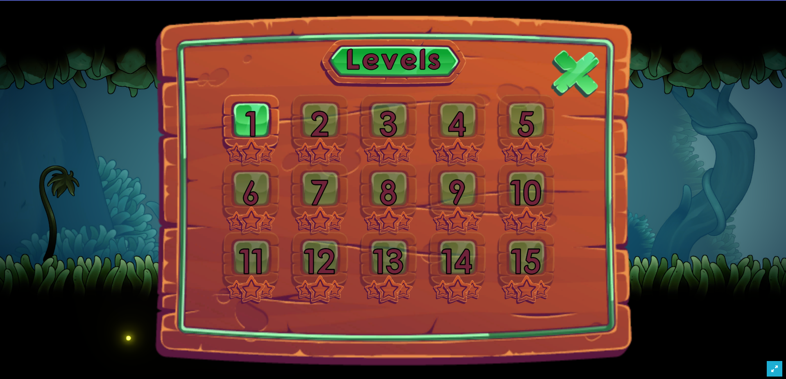
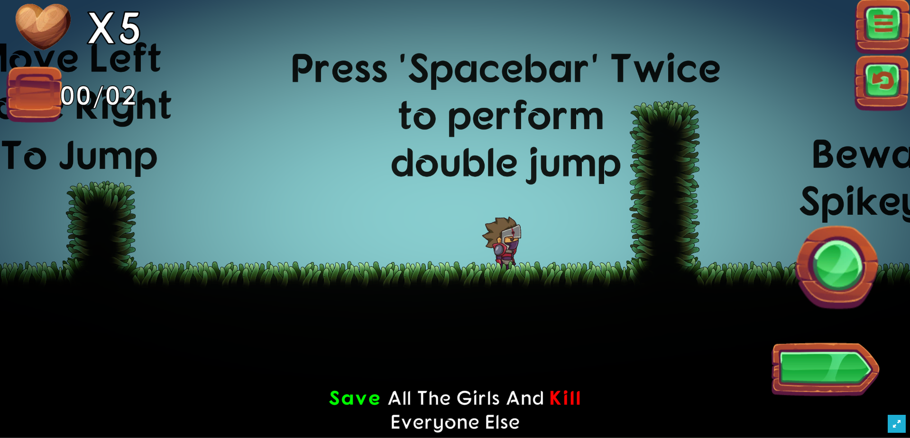
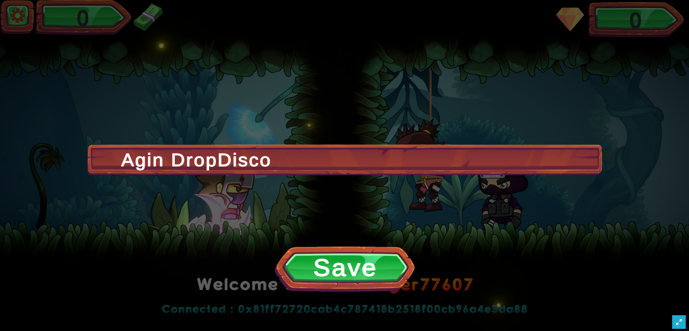
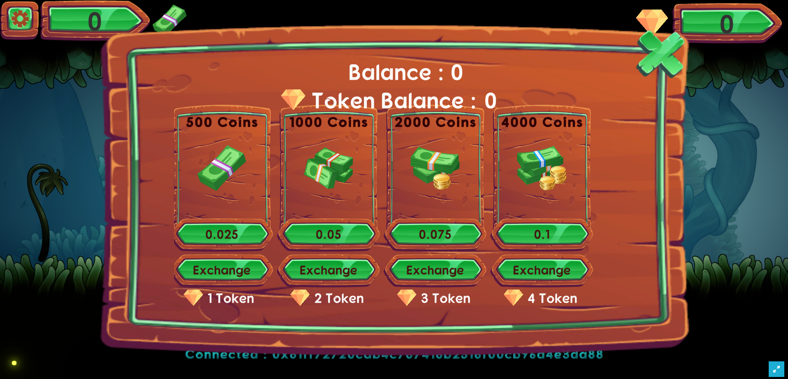
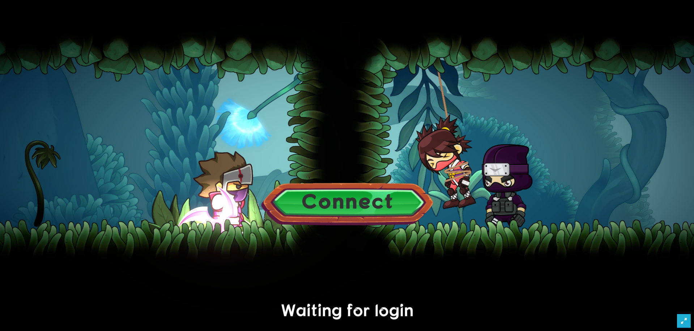

## SAGE
SAGE "Save the Lost Girl" is a web adventure game with a mission to save a girl who is missing/captured by enemy forces named "SAGE", this game is dedicated to the Omnichain Hackathon which combines Unity, Web3, Zetachain and other technologies.

## WHY?
1. Have an on-chain game audit trail of each user that is stored in a database collection and stored in IPFS.

2. Safely share selected data from digital documents because SAGE does not store personal data like other game platforms.

3. Our platform opens up web3 workflows with smart contract hooks and AI

4. Using a decentralized Zetachain and public blockchain as well as technologies that can revolutionize performance in gaming platforms using web3.

5. Play to Earn: Each players will get the rewards(SageNFT) if they completed each levels and can swap with SageToken(Core token for SAGE: ERC20)

## There are 2 main repos:
1. Contract Data: Uses Solidity to complete the entire Game Protocol.

2. Data Game Project: Using Web3, Unity and Zetachain for on-chain development in game development.

## Smart Contracs on Zetachain
1. Sage Token: [0xc02703c7615Dbe47EAF58187eEF65AEf046B0955](https://explorer.zetachain.com/address/0xc02703c7615Dbe47EAF58187eEF65AEf046B0955)
2. SageNFT: [0x6e60f22De27AeF308eEbD45030B73cEb7160c745](https://explorer.zetachain.com/address/0x6e60f22De27AeF308eEbD45030B73cEb7160c745)

## Game Demo : 
[https://zeta-sage.vercel.app/](https://zeta-sage.vercel.app/)

## Gameplay Video Demo: 
https://youtu.be/nhZsqBPxWPc

## Challenges we ran into
Vertical 6: Games & Gamefi

## Features.
- Bridge
- More Characters
- More Levels to Complete
- More incentives

## Tech.
- Zetachain
- Metamask
- Hardhat
- Web3Unity
- Unity

## Wallets:
- Metamask
- WalletConnect
- Torus

### Buy Hero

### Game Level

### Gameplay

### Edit Profile

### Swap/Buy Token

### Wallet Connector

